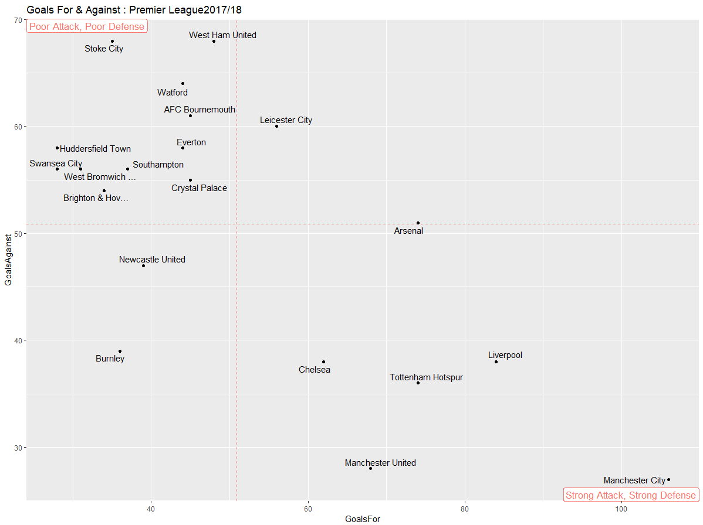
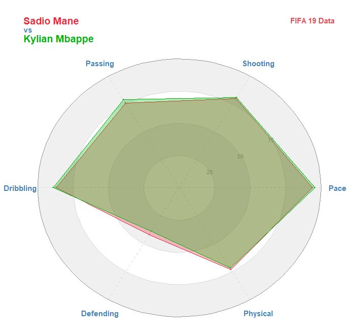
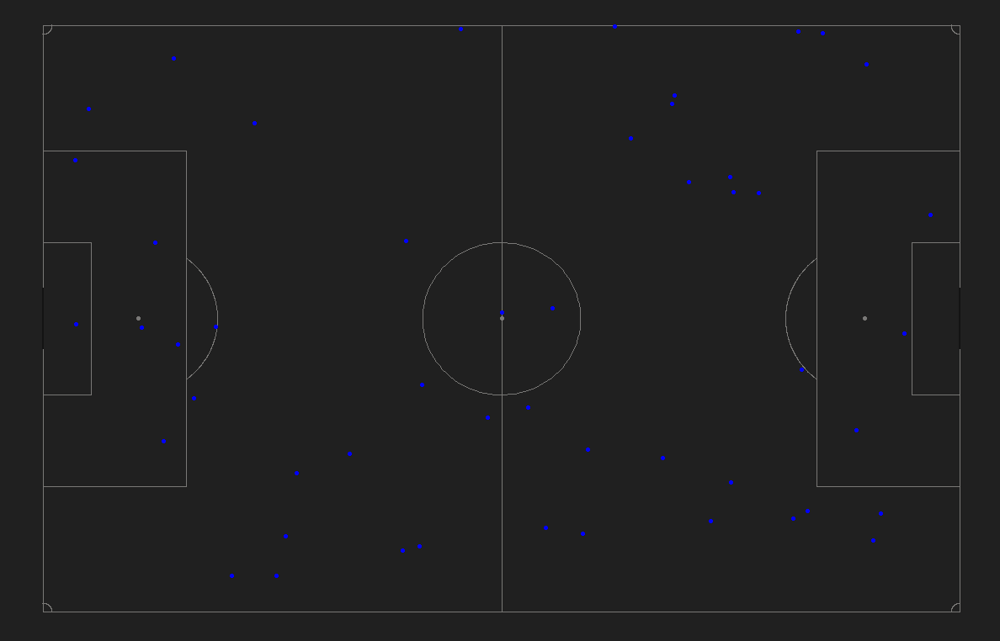
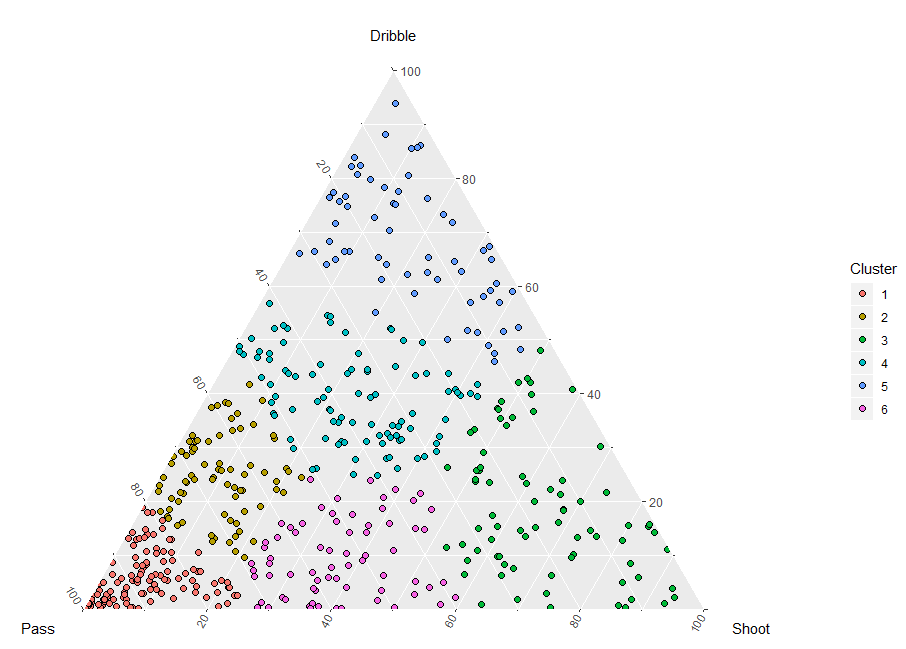
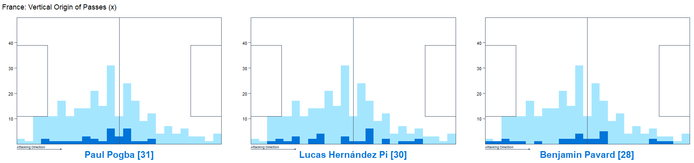

## Visualizations based on FcRStats repository

Learn to build data visualisations in R

1. [Scatter Plots & Crosshairs with ggPlot2 - EPL2017-18](https://github.com/davidfombella/FCrSTATS/blob/master/Visualizations/1_ScatterPlots_and_CrossHairs_EPL_2017_18_Goals_For_and_Against.R)
    
	
2. [Building a Radar Plot: from the ground up in ggplot2](https://github.com/davidfombella/FCrSTATS/blob/master/Visualizations/2_Build_Radar_Chart_Messi_vs_Traore.R)
   
   
3. [Building a Pitch in R with ggplot2](https://github.com/davidfombella/FCrSTATS/blob/master/Visualizations/3_Create_Pitch.R)
   
4. [Mapping Pass Locations on an Football Pitch with ggplot2](https://github.com/davidfombella/FCrSTATS/blob/master/Visualizations/4_Map_Pass_Locations.R)
     
   
5. [Ternary Plots and K-means Clustering](https://github.com/davidfombella/FCrSTATS/blob/master/Visualizations/5_Ternary_Plots.R)
   
   
6. [Layered Histograms to show Passing Origins with France in Final World Cup 2018 from Statsbomb](https://github.com/davidfombella/FCrSTATS/blob/master/Visualizations/6_Passing_Origins_StatsBomb.R)
   